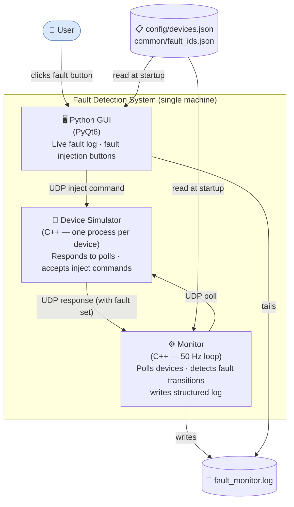
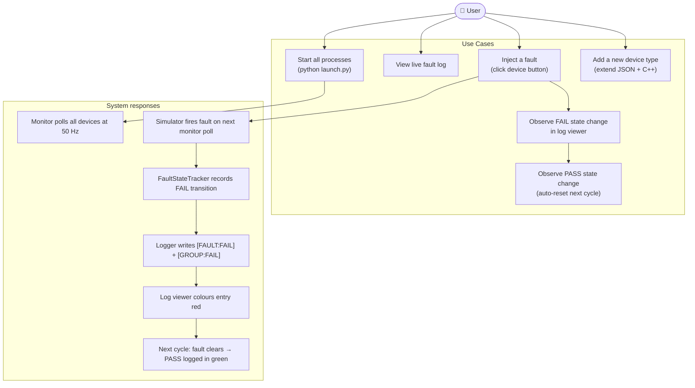
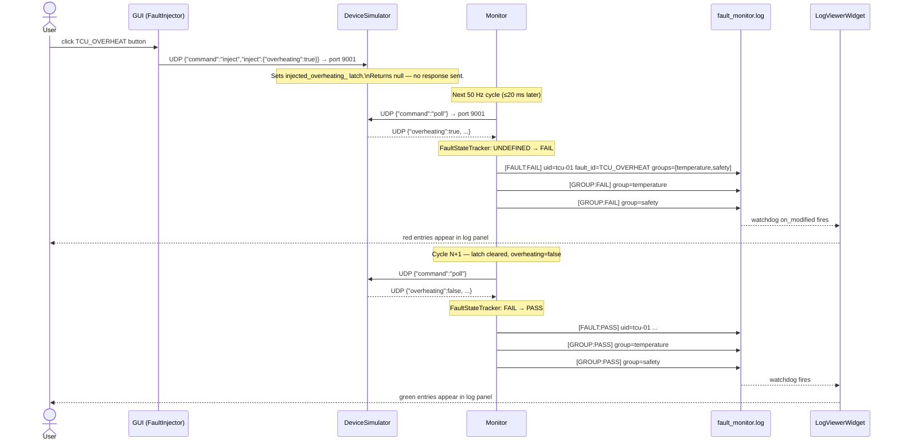
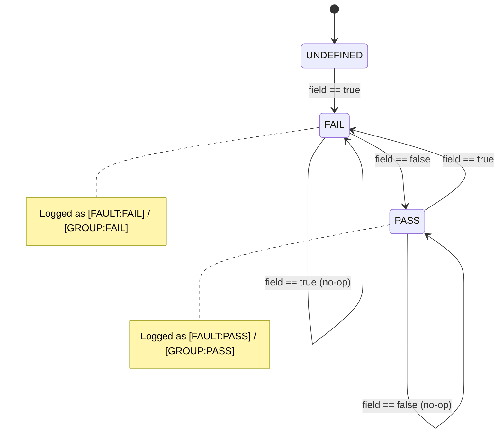

# Fault Detection System

A real-time home equipment monitoring system that runs three cooperating processes on a single machine. A C++ monitor polls devices at 50 Hz over UDP, detects boolean fault conditions, and logs structured state-change events. A C++ device simulator responds to polls and accepts one-shot fault injections from the GUI. A Python GUI provides a live fault log viewer and a per-device fault injection panel.

---

## System Architecture

### C4 Context — What the system does and who uses it



### Component Diagram — Internal structure

```mermaid
graph LR
    subgraph monitor["monitor (C++)"]
        M[Monitor\n50Hz loop]
        DP[DeviceProxy\nper device]
        FST[FaultStateTracker\nindividual + group state]
        FL[FaultLogger\nspdlog file+console]
        CL_M[ConfigLoader]
        US_M[UdpSocket\nephemeral local port]
        M --> DP
        M --> FST
        M --> FL
        M --> CL_M
        DP --> US_M
    end

    subgraph sim["device_simulator (C++)"]
        DS[DeviceSimulator\nrecvfrom loop]
        ID[IDevice\ninterface]
        TCU[TemperatureControlUnit]
        GD[GarageDoor]
        US_S[UdpSocket\nbound port]
        DS --> ID
        DS --> US_S
        ID <|.. TCU
        ID <|.. GD
    end

    subgraph gui["gui (Python / PyQt6)"]
        MW[MainWindow]
        LV[LogViewerWidget\nwatchdog tail]
        DP2[DevicePanelWidget]
        DC[DeviceCardWidget\nper device]
        FI[FaultInjector\nUDP send]
        CL_G[ConfigLoader]
        MW --> LV
        MW --> DP2
        DP2 --> DC
        DC --> FI
    end

    subgraph codegen["codegen (Python)"]
        CG[codegen.py\nJinja2 templates]
        MSG["common/messages/*.json"]
        FID["common/fault_ids.json"]
        GEN_CPP["generated/cpp/\n*.hpp  FaultIds.hpp"]
        GEN_PY["generated/python/\n*.py  fault_ids.py"]
        MSG --> CG
        FID --> CG
        CG --> GEN_CPP
        CG --> GEN_PY
    end

    GEN_CPP --> monitor
    GEN_PY  --> gui
```

---

## Use Cases



---

## Fault Injection Sequence

The following shows what happens from button click to GUI update:



---

## Fault State Machine

Each `(device_uid, fault_id)` pair and each `group_id` tracks one of three states:



Group state follows the same machine but transitions only when:
- **→ FAIL**: the first member in the group transitions to FAIL
- **→ PASS**: ALL members in the group have left the FAIL state

---

## Quick Start

### Prerequisites
| Tool | Version | Notes |
|------|---------|-------|
| Visual Studio 2022 Build Tools | 17+ | includes CMake + CTest |
| Python | 3.11+ | |
| Git | any | |

### Build and run

```bat
:: 1. Install Python dependencies
pip install -r requirements.txt

:: 2. Build C++ (configure on first run, incremental after)
build.bat

:: 3. Start everything
python launch.py
```

`build.bat clean` deletes `build/` and reconfigures from scratch.

### Manual per-component startup

```bat
:: Device simulators (one per device)
build\device_simulator\Release\device_simulator.exe --type TemperatureControlUnit --uid tcu-01 --port 9001
build\device_simulator\Release\device_simulator.exe --type GarageDoor             --uid gd-01  --port 9003

:: Monitor
build\monitor\Release\monitor.exe --config config\devices.json --log fault_monitor.log

:: GUI
python gui\main.py --config config\devices.json --log fault_monitor.log
```

### Run tests only

```bat
:: C++ unit tests
ctest --test-dir build -C Release --output-on-failure

:: Python unit tests
python -m pytest gui\tests\ -v
```

---

## Project Structure

```
fault-detection-system/
│
├── common/                        JSON source-of-truth definitions
│   ├── messages/                    Message field schemas (no fault logic)
│   │   ├── temperature_control_unit_command.json
│   │   ├── temperature_control_unit_response.json
│   │   ├── garage_door_command.json
│   │   └── garage_door_response.json
│   └── fault_ids.json               Fault IDs, numeric IDs, group memberships
│
├── codegen/                       Code generator (run before build)
│   ├── codegen.py                   Jinja2-based generator
│   └── templates/                   C++ header + Python dataclass templates
│
├── generated/                     Auto-generated (gitignored, rebuilt each build)
│   ├── cpp/                         C++ message structs + FaultIds.hpp
│   └── python/                      Python dataclasses + fault_ids.py
│
├── monitor/                       C++ monitor application
│   ├── src/                         Source files
│   ├── tests/                       Google Test unit tests
│   └── README.md                    Component documentation
│
├── device_simulator/              C++ device simulator application
│   ├── src/
│   ├── tests/
│   └── README.md
│
├── gui/                           Python PyQt6 GUI
│   ├── app/                         Application modules
│   ├── tests/                       pytest unit tests
│   └── README.md
│
├── config/
│   └── devices.json               Device instance list (uid, type, port)
│
├── CMakeLists.txt                 Root build file (FetchContent deps)
├── build.bat                      One-command build + test script
├── launch.py                      Process launcher
└── requirements.txt               Python dependencies
```

---

## Adding a New Device Type

1. **Define messages** — add `common/messages/<type>_command.json` and `<type>_response.json`
2. **Define faults** — add entries to `common/fault_ids.json` with `device_type`, `field`, `groups`
3. **Implement simulator** — add a class derived from `IDevice` in `device_simulator/src/`
4. **Register type** — add a branch in `device_simulator/src/main.cpp`
5. **Add to config** — add an entry to `config/devices.json`
6. **Rebuild** — `build.bat` runs codegen automatically; the monitor and GUI pick up the new device with no source changes

The monitor, `FaultStateTracker`, and GUI all derive their knowledge of fault fields and groups purely from the generated `FaultIds.hpp` / `fault_ids.py` — there are no hard-coded device names anywhere in monitoring or GUI code.

---

## Log Format

The log file (`fault_monitor.log`) records all events. The GUI displays only fault/group state changes.

| Tag | Level | Meaning |
|-----|-------|---------|
| `[SEND]` | INFO | Monitor sent a poll command |
| `[RECV]` | INFO | Monitor received a device response |
| `[FAULT:FAIL]` | WARN | A fault field transitioned to true |
| `[FAULT:PASS]` | INFO | A fault field cleared back to false |
| `[GROUP:FAIL]` | WARN | First fault in a group triggered |
| `[GROUP:PASS]` | INFO | All faults in a group cleared |
| `[TIMEOUT]` | WARN | Device did not respond within 5 ms |
| `[OVERRUN]` | WARN | 50 Hz cycle took longer than 20 ms |

Example entries:
```
[2026-03-29 10:00:00.022] [warning] [FAULT:FAIL]  uid=tcu-01  fault_id=TCU_OVERHEAT  numeric_id=1  groups=[temperature,safety]
[2026-03-29 10:00:00.022] [warning] [GROUP:FAIL]  group=temperature
[2026-03-29 10:00:00.042] [info]    [FAULT:PASS]  uid=tcu-01  fault_id=TCU_OVERHEAT  numeric_id=1  groups=[temperature,safety]
[2026-03-29 10:00:00.042] [info]    [GROUP:PASS]  group=temperature
```

---

## Component Documentation

| Component | Language | README |
|-----------|----------|--------|
| Monitor | C++ (MSVC) | [monitor/README.md](monitor/README.md) |
| Device Simulator | C++ (MSVC) | [device_simulator/README.md](device_simulator/README.md) |
| GUI | Python 3 / PyQt6 | [gui/README.md](gui/README.md) |
