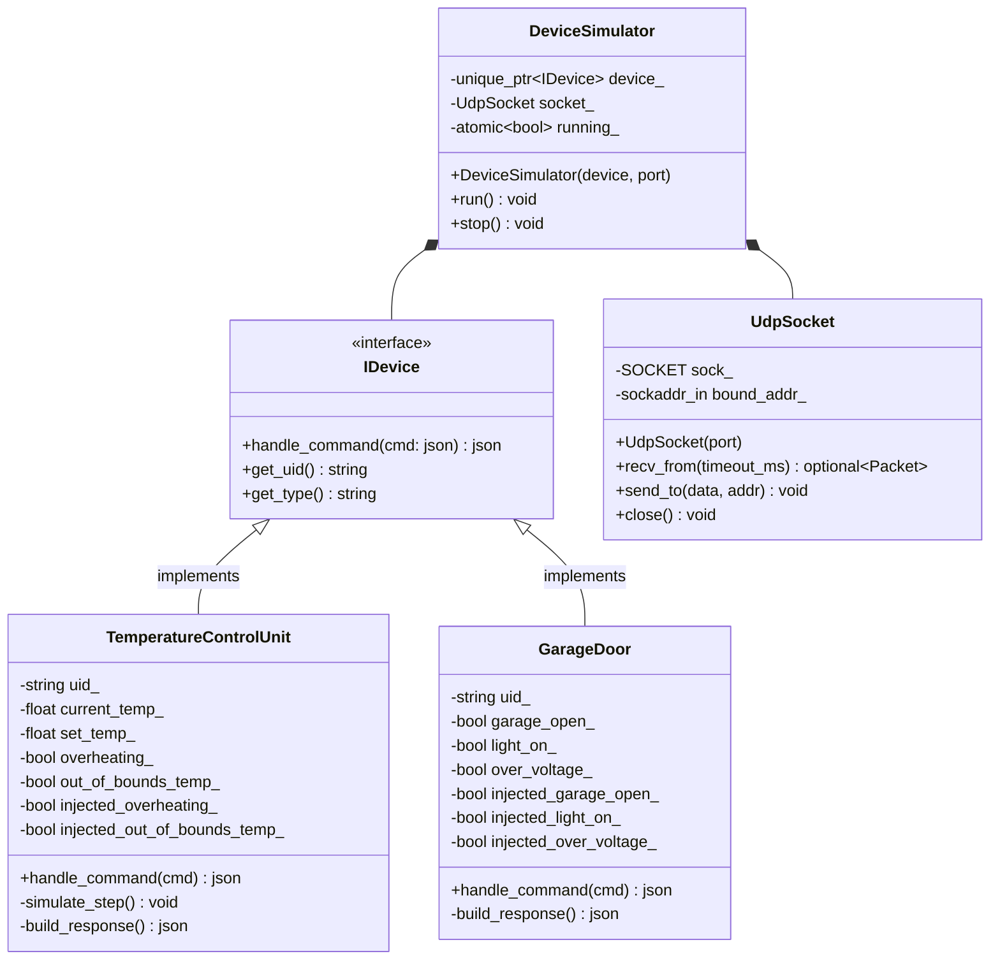
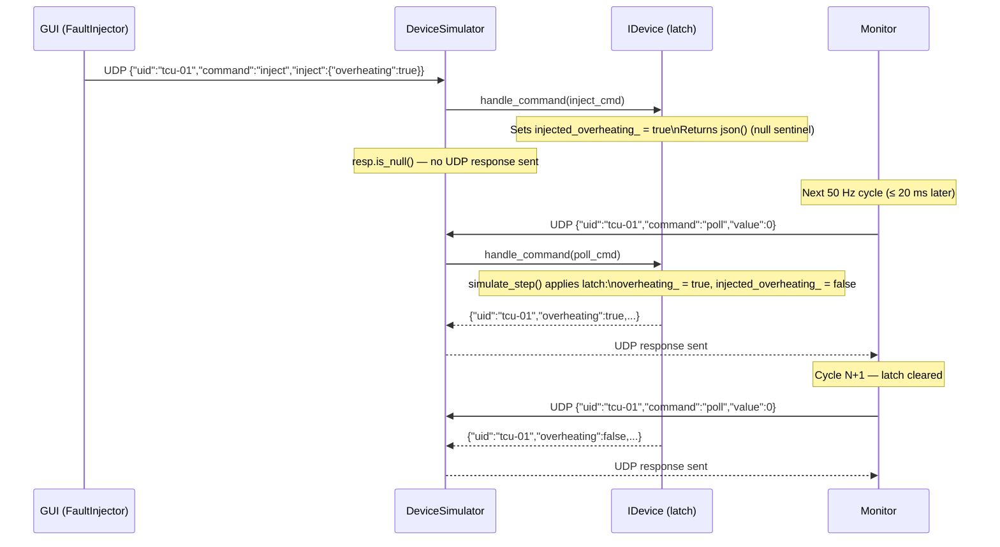

# Device Simulator

The device simulator represents one physical device instance. Each simulator process binds a UDP port, waits for commands from the monitor, and returns raw sensor state in its responses. Multiple simulator processes can run simultaneously — one per device entry in `config/devices.json`.

**Device simulators are fault-unaware.** They have no knowledge of `fault_ids.json`, fault IDs, or groups. They simply return boolean sensor fields; the monitor is solely responsible for deciding whether a field constitutes a fault.

---

## Class Diagram



---

## Fault Injection Protocol

Fault injection is a two-step, one-shot mechanism. The GUI sends an inject command; the simulator sets a latch and returns nothing. The latch fires once on the next monitor poll, then clears automatically.



**Key invariants**:
- An inject command returns `json()` (null); `DeviceSimulator::run()` checks `resp.is_null()` before sending a UDP reply.
- The latch fires exactly once — on the poll that follows the inject, not on the inject itself.
- Each fault field has its own independent latch; injecting two fields in sequence is safe.

---

## Command / Response JSON

### Poll command (monitor → simulator)
```json
{ "uid": "tcu-01", "command": "poll", "value": 0 }
```

### Inject command (GUI → simulator)
```json
{ "uid": "tcu-01", "command": "inject", "inject": { "overheating": true } }
```

### TemperatureControlUnit response
```json
{
  "uid":                "tcu-01",
  "current_temp":       20.5,
  "set_temp":           22.0,
  "overheating":        false,
  "out_of_bounds_temp": false
}
```

### GarageDoor response
```json
{
  "uid":          "gd-01",
  "garage_open":  false,
  "light_on":     false,
  "over_voltage": false
}
```

---

## CLI Usage

```bat
device_simulator.exe --type <DeviceType> --uid <uid> --port <port>
```

| Argument | Required | Example |
|----------|----------|---------|
| `--type` | Yes | `TemperatureControlUnit`, `GarageDoor` |
| `--uid`  | Yes | `tcu-01`, `gd-01` |
| `--port` | Yes | `9001` |

Examples:
```bat
device_simulator.exe --type TemperatureControlUnit --uid tcu-01 --port 9001
device_simulator.exe --type TemperatureControlUnit --uid tcu-02 --port 9002
device_simulator.exe --type GarageDoor             --uid gd-01  --port 9003
```

Each invocation is a separate process. The simulator runs until the process is terminated (Ctrl+C or killed by `launch.py`).

---

## Adding a New Device Type

1. Add `common/messages/<type>_command.json` and `<type>_response.json`.
2. Add fault entries in `common/fault_ids.json` pointing to the new `device_type`.
3. Create `<Type>.hpp` / `<Type>.cpp` implementing `IDevice`. Follow the inject-latch pattern used by `TemperatureControlUnit` and `GarageDoor`.
4. Register the new type in `main.cpp`:
   ```cpp
   if (type == "MyNewDevice")
       device = std::make_unique<MyNewDevice>(uid);
   ```
5. `build.bat` runs codegen automatically; no monitor or GUI source changes are needed.

---

## Source Files

| File | Responsibility |
|------|---------------|
| `main.cpp` | Entry point; parses `--type`, `--uid`, `--port`; constructs `IDevice`; starts `DeviceSimulator` |
| `IDevice.hpp` | Abstract interface: `handle_command`, `get_uid`, `get_type` |
| `DeviceSimulator.hpp/.cpp` | UDP receive-respond loop; null-guard before sending response |
| `TemperatureControlUnit.hpp/.cpp` | TCU sensor simulation and inject latches |
| `GarageDoor.hpp/.cpp` | Garage door sensor simulation and inject latches |
| `UdpSocket.hpp/.cpp` | Winsock2 UDP wrapper (bound to known port; `recvfrom` / `sendto`) |

---

## Unit Tests

Tests live in `device_simulator/tests/` and are registered with CTest.

| Test file | What it covers |
|-----------|---------------|
| `test_temperature_control_unit.cpp` | Normal poll (all false); inject returns null; latch fires once then clears; two independent fields; `get_type`/`get_uid` |
| `test_garage_door.cpp` | Same coverage for `garage_open`, `light_on`, `over_voltage`; inject returns null |

Run with:
```bat
ctest --test-dir build -C Release --output-on-failure
```
