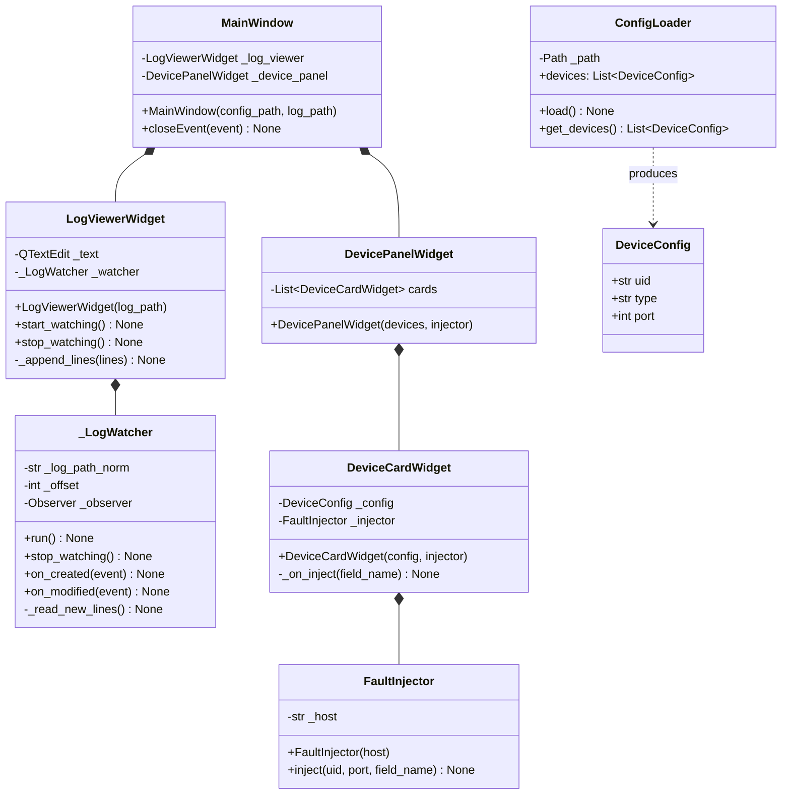
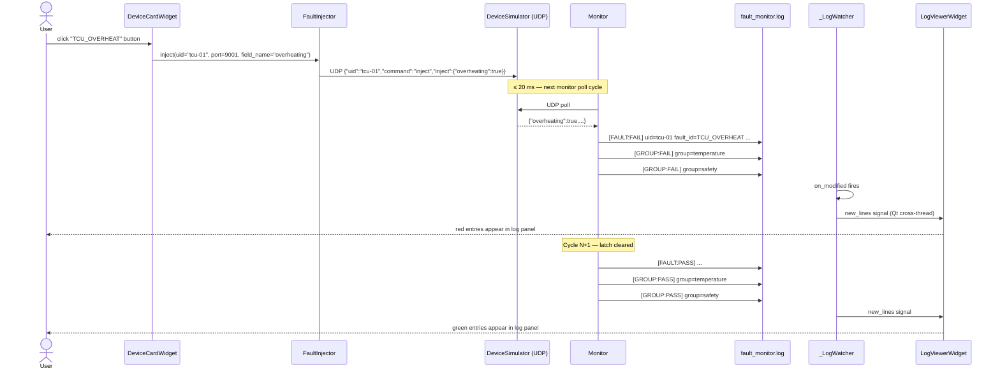

# GUI

A PyQt6 desktop application that provides two panels side by side: a live fault log viewer on the left, and a fault injection control panel on the right. The GUI reads `config/devices.json` and the generated `fault_ids.py` at startup — no device names or fault fields are hard-coded.

---

## Widget Hierarchy



---

## Fault Injection Sequence



---

## Log Colour Scheme

The log viewer filters and colours lines based on their tag. Lines containing `[SEND]`, `[RECV]`, or `[TIMEOUT]` are not displayed.

| Tag | Colour | Hex |
|-----|--------|-----|
| `[FAULT:FAIL]` | Red | `#e53935` |
| `[GROUP:FAIL]` | Red | `#e53935` |
| `[FAULT:PASS]` | Green | `#43a047` |
| `[GROUP:PASS]` | Green | `#43a047` |

All other visible text uses the default dark-theme foreground (`#d4d4d4`).

---

## File Watching

`_LogWatcher` runs in a background `QThread` and uses the `watchdog` library to detect file changes:

- **`on_modified`** — fires when the monitor appends new lines (the common case)
- **`on_created`** — fires if the log file appears after the watcher starts (e.g. monitor starts slowly); resets the read offset to zero so no lines are missed
- Path comparison uses `os.path.normcase(os.path.abspath())` for reliable Windows behaviour regardless of drive letter case or trailing separators

New lines are emitted via a `pyqtSignal(list)` which Qt delivers on the main thread, keeping all widget updates safe.

---

## Source Files

| File | Responsibility |
|------|---------------|
| `main.py` | Entry point; parses `--config` and `--log`; sets dark Fusion palette; shows `MainWindow` |
| `app/MainWindow.py` | Top-level window; `QSplitter` layout; starts/stops log watcher |
| `app/LogViewerWidget.py` | Read-only `QTextEdit` log viewer with file watcher and colour formatter |
| `app/DevicePanelWidget.py` | Scrollable panel holding one `DeviceCardWidget` per device |
| `app/DeviceCardWidget.py` | `QGroupBox` with one inject button per fault ID (from generated registry) |
| `app/FaultInjector.py` | Sends UDP inject command to simulator |
| `app/ConfigLoader.py` | Reads `config/devices.json` into `DeviceConfig` dataclasses |

---

## Unit Tests

Tests live in `gui/tests/` and are run with pytest.

| Test file | What it covers |
|-----------|---------------|
| `test_fault_injector.py` | Correct JSON payload sent to correct port; `"command":"inject"` key present; field set to true |
| `test_config_loader.py` | Valid config parsed; missing file raises `FileNotFoundError`; missing `devices` key raises `ValueError` |

Run with:
```bat
python -m pytest gui\tests\ -v
```

---

## Command-Line Arguments

```
python gui/main.py --config <path> --log <path>
```

| Argument | Default | Description |
|----------|---------|-------------|
| `--config` | `config/devices.json` | Path to device configuration file |
| `--log` | `fault_monitor.log` | Path to the log file to tail |
