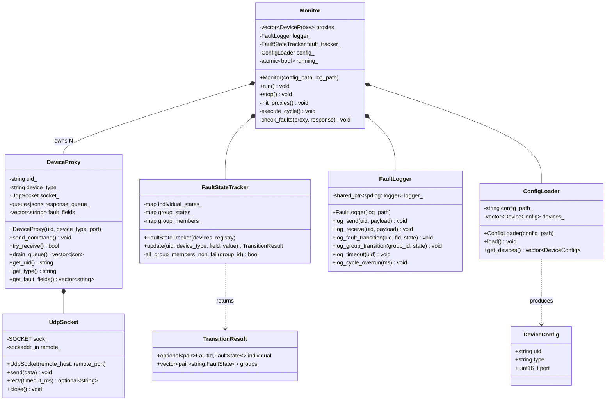
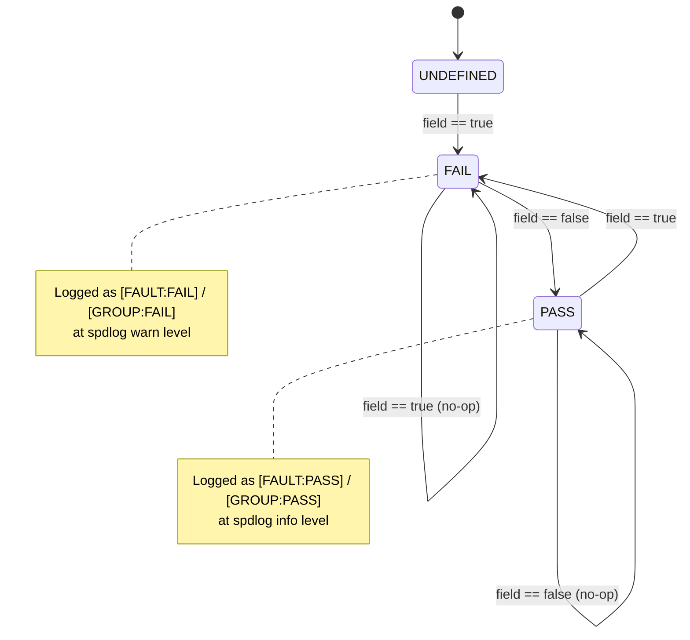

# Monitor

The monitor is the core of the fault detection system. It runs a fixed 50 Hz polling loop, sends UDP commands to every configured device simulator, evaluates the responses against the fault ID registry, and writes structured log entries whenever a fault state changes.

The monitor has **no hard-coded device names or fault fields**. Everything it knows about faults is derived at startup from the generated `FaultIds.hpp`, which in turn is produced from `common/fault_ids.json`.

---

## Class Diagram



---

## 50 Hz Cycle Sequence

Each cycle is bounded to 20 ms (50 Hz). Commands go out first, then the monitor waits 5 ms for UDP responses to arrive, then it processes everything received.

```mermaid
sequenceDiagram
    participant Loop as Monitor::run()
    participant Cycle as execute_cycle()
    participant Proxy as DeviceProxy
    participant Sim as DeviceSimulator
    participant Tracker as FaultStateTracker
    participant Logger as FaultLogger

    Loop->>Cycle: t = 0 ms
    loop for each proxy
        Cycle->>Proxy: send_command()
        Proxy-->>Sim: UDP {"uid":"...","command":"poll","value":0}
        Cycle->>Logger: log_send(uid, payload)
    end

    Cycle->>Cycle: sleep_until(cycle_start + 5 ms)

    loop for each proxy
        Cycle->>Proxy: try_receive()
        alt response received
            Proxy-->>Cycle: response JSON
            Cycle->>Logger: log_receive(uid, payload)
            loop for each fault field in proxy
                Cycle->>Tracker: update(uid, type, field, value)
                Tracker-->>Cycle: TransitionResult
                opt individual transitioned
                    Cycle->>Logger: log_fault_transition(uid, fid, state)
                end
                loop for each group transition
                    Cycle->>Logger: log_group_transition(group_id, state)
                end
            end
        else timeout
            Cycle->>Logger: log_timeout(uid)
        end
    end

    Loop->>Loop: sleep_until(cycle_start + 20 ms)
    Note over Loop: If now > deadline, log_cycle_overrun instead
```

---

## Fault State Machine

Each `(uid, fault_id)` pair and each `group_id` follows this three-state machine. Only transitions are logged — steady state generates no output.



**Group transition rules** differ from individual rules:

| Event | Group transitions to FAIL when... | Group transitions to PASS when... |
|---|---|---|
| Individual → FAIL | Group is not already FAIL | — |
| Individual → PASS | — | ALL members in the group are PASS or UNDEFINED |

This means a group stays FAIL until the last member clears.

---

## Log Format

The log file receives every event. The GUI displays only fault/group state-change lines.

| Tag | spdlog Level | Meaning |
|-----|-------------|---------|
| `[SEND]` | info | Monitor sent a poll command |
| `[RECV]` | info | Monitor received a device response |
| `[FAULT:FAIL]` | warn | Fault field transitioned to true |
| `[FAULT:PASS]` | info | Fault field cleared back to false |
| `[GROUP:FAIL]` | warn | First fault in a group triggered |
| `[GROUP:PASS]` | info | All faults in a group cleared |
| `[TIMEOUT]` | warn | Device did not respond within 5 ms |
| `[OVERRUN]` | warn | 50 Hz cycle took longer than 20 ms |

Example entries:
```
[2026-03-29 10:00:00.022] [info]    [SEND]         uid=tcu-01  {"uid":"tcu-01","command":"poll","value":0}
[2026-03-29 10:00:00.022] [info]    [RECV]         uid=tcu-01  {"uid":"tcu-01","overheating":true,...}
[2026-03-29 10:00:00.022] [warning] [FAULT:FAIL]   uid=tcu-01  fault_id=TCU_OVERHEAT  numeric_id=1  groups=[temperature,safety]
[2026-03-29 10:00:00.022] [warning] [GROUP:FAIL]   group=temperature
[2026-03-29 10:00:00.022] [warning] [GROUP:FAIL]   group=safety
[2026-03-29 10:00:00.042] [info]    [FAULT:PASS]   uid=tcu-01  fault_id=TCU_OVERHEAT  numeric_id=1  groups=[temperature,safety]
[2026-03-29 10:00:00.042] [info]    [GROUP:PASS]   group=temperature
[2026-03-29 10:00:00.042] [info]    [GROUP:PASS]   group=safety
```

**spdlog sink configuration**:
- File sink — receives everything at trace level; written immediately (`flush_on(trace)`)
- Console sink — set to `err` level; silent during normal operation

---

## Source Files

| File | Responsibility |
|------|---------------|
| `main.cpp` | Entry point; parses `--config` and `--log` args, constructs `Monitor`, calls `run()` |
| `Monitor.hpp/.cpp` | 50 Hz loop, cycle orchestration, fault-check dispatch |
| `FaultStateTracker.hpp/.cpp` | Two-level state machine (individual + group) |
| `FaultLogger.hpp/.cpp` | spdlog multi-sink logger with structured tag format |
| `DeviceProxy.hpp/.cpp` | Per-device UDP I/O, fault field list from registry |
| `UdpSocket.hpp/.cpp` | Winsock2 UDP wrapper (ephemeral local port) |
| `ConfigLoader.hpp/.cpp` | Reads `config/devices.json` into `DeviceConfig` structs |

---

## Unit Tests

Tests live in `monitor/tests/` and are registered with CTest via `gtest_discover_tests()`.

| Test file | What it covers |
|-----------|---------------|
| `test_fault_state_tracker.cpp` | UNDEFINED→FAIL, FAIL→PASS, no-op on repeated state; group FAIL on first member; group PASS only when all members clear; multi-device groups |
| `test_fault_logger.cpp` | `[FAULT:FAIL]` at warn level, `[FAULT:PASS]` at info level, group entries present, file written |
| `test_device_proxy.cpp` | `fault_fields_` populated from registry (not hard-coded); timeout returns false |
| `test_config_loader.cpp` | Valid JSON parsed correctly; missing fields throw |

Run with:
```bat
ctest --test-dir build -C Release --output-on-failure
```
